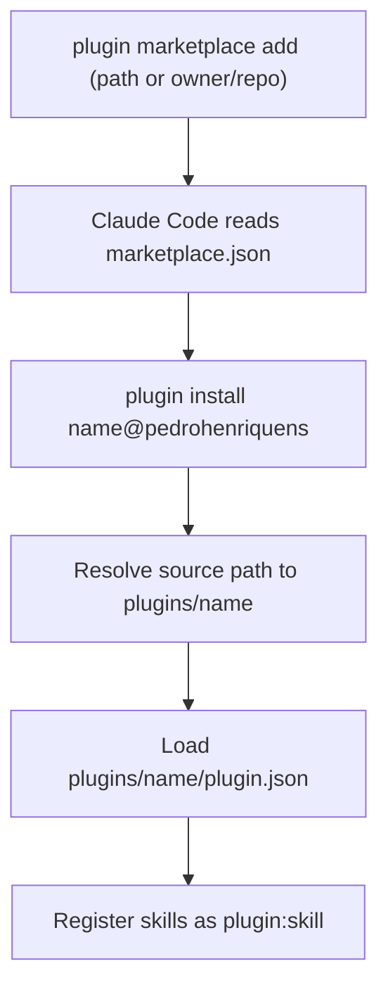

# Architecture

This repo is a **catalog**, not a program. Its "architecture" is three nested layers of manifest plus the content they point at, and the install-time flow that resolves them. There is no runtime here — Claude Code is the runtime; this repo is data it reads.

## The three manifest layers

| Layer | File | Owns |
|---|---|---|
| Marketplace | `.claude-plugin/marketplace.json` | The catalog: marketplace `name`, `owner`, and the list of plugins with their relative `source` paths and versions. |
| Plugin | `plugins/<name>/.claude-plugin/plugin.json` | One plugin's identity: `name`, `version`, `description`, `author`, `keywords`. |
| Skill | `plugins/<name>/skills/<skill>/SKILL.md` | The actual capability — the prompt/instructions Claude loads when the skill triggers. Optional `references/`, `templates/`, `evals/` siblings. |

The key non-obvious fact: a plugin's `version` is written **twice** — in its `plugin.json` and in its `marketplace.json` entry — and the two must match. Nothing enforces this but `claude plugin validate` and review.

## Repository layout

```
claude-marketplace/
├── .claude-plugin/
│   └── marketplace.json              # catalog: name "pedrohenriquens", owner, 9 plugins
├── plugins/
│   └── <plugin>/
│       ├── .claude-plugin/
│       │   └── plugin.json           # plugin identity + version
│       └── skills/
│           └── <skill>/
│               ├── SKILL.md          # the capability
│               ├── references/       # optional deep-dive docs (progressive disclosure)
│               ├── templates/        # optional output templates
│               └── evals/evals.json  # optional trigger/quality evals
├── docs/                             # this living documentation
├── README.md
├── NOTICE                            # third-party attribution (marketing-skills)
├── .gitignore
└── .gitattributes                    # text=auto → LF normalization
```

The indentation **is** the diagram — agents parse these paths natively, so no graph is needed for structure.

## Install-time resolution

What happens when a user adds the marketplace and installs a plugin:



**Constraints** (the diagram shows order; these are the rules it can't carry):

- `source` is a path **relative to the repo root** (`./plugins/<name>`), so the whole catalog resolves from one repo — local path or GitHub `owner/repo` both work without per-plugin packaging.
- The install suffix is the **marketplace name** (`@pedrohenriquens`), not the repo/folder name (`claude-marketplace`). They differ on purpose: `claude-*` names are reserved.
- Installed skills are **namespaced** `<plugin>:<skill>` (e.g. `marketing-skills:seo-audit`). Skill names need only be unique within their plugin, not globally.
- `plugin.json` version and the `marketplace.json` entry version must agree, or installs pick up the wrong/stale version. Bump both together.

## Key design decisions

- **Single-repo catalog.** Every `source` points inside this repo rather than at external repos, so one clone/push distributes everything. Trade-off: this repo grows with each plugin, but there's no submodule or multi-repo coordination.
- **No build step.** Skills are authored Markdown; manifests are hand-written JSON. The only "tooling" is `claude plugin validate`. This keeps contribution friction near zero.
- **Derived content is isolated and attributed.** `marketing-skills` is recreated from a third party and fenced off behind [../NOTICE](../NOTICE); everything else is original. See [CONVENTIONS.md](./CONVENTIONS.md).

## Related docs

- [STACK.md](./STACK.md) — the manifest formats and validation tool in detail
- [CONVENTIONS.md](./CONVENTIONS.md) — rules for authoring plugins and skills
- [FEATURES.md](./FEATURES.md) — what each plugin actually does
- [PITFALLS.md](./PITFALLS.md) — the gotchas this layout has already produced
